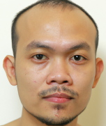
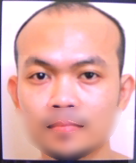

# 概要
髭を除去する仮想カメラのサンプル

以下の様に顔の下半分をぼかすことで髭を目立たなくする

処理前

処理後

# 動作確認環境
Windows 10
Python 3.9.13

# 使い方
1. OBS Studioをインストールする
    - これで仮想カメラの出力先が用意される
2. `pip install -r requirements.txt`
3. `python main.py`
    - プレビューウィンドウが立ち上がる
4. カメラを使用する任意のソフトの設定で「OBS Virtual Camera」を選択する